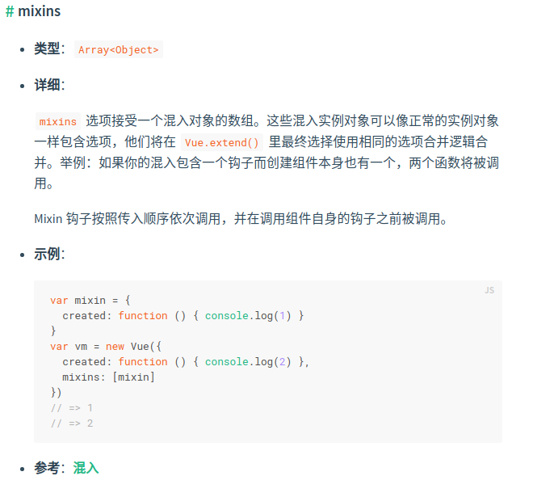
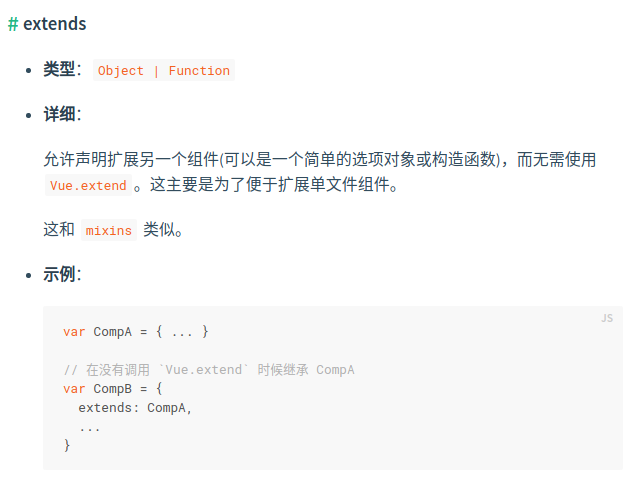
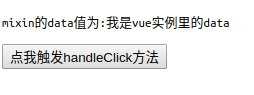

# 你不知道的JS
## new
```js
// function test(name) {
//     this.name = name
//     console.log(this)
// }
//
// test.prototype.sayName = function () {
//     console.log(this.name)
// }
// const t = new test('qfh')
// t.name
// t.sayName()
// //new出来的实例,可以访问构造函数的属性.
// //new出来的实例,可以访问构造函数原型上的方法,通过new,实例与构造函数通过原型链连接了起来.
// function Test(name) {
//     this.name = name
//     // return 'dfasdfasd'
//     return 231231 || 'dfasdfasdf'
// }
//
// const t = new Test('qfh')
// console.log(t.name)

// 如果构造函数返回原始值,那么这个构造函数毫无意义


// function Test(name) {
//     this.name = name
//     return {ddd: 23123}
// }
//
// const t = new Test('qfh')
// console.log(t.name)
// 如果构造函数返回对象,返回值会正常使用


// new:
// - new操作符会返回一个对象
// - 对象可以访问到挂载在this上的任意属性
// - 对象可以访问到构造函数原型上的属性,所以需要将对象与构造函数链接起来
// - 返回原始值无效,返回对象有效

function create(Con, ...args) {
    let obj = {}
    Object.setPrototypeOf(obj, Con.prototype)
    let result = Con.apply(obj, args)
    return result instanceof Object ? result : obj

}

// - Con构造函数,args被构造函数所使用的参数
// - 创建空对象obj
// - 等同于 obj._proto_=Con.prototype
// - 构造函数绑定对象和其余参数
// - 判断构造函数返回的是否是对象?返回对象:否则就是对象本身

function Test(name) {
    this.name = name
    // return '3123123'
    return {
        aa: 12312,
        ddd:234234
    }
}

const t = create(Test, 'qfh')
console.log(t.ddd)

```
## rest
```js
function f(...args) {
    console.log(args)//[ 1, 2, 3, 123, 434, 54, 65563566 ]
    console.log(args[2] + args[3] + args[4])//560
}

f(1, 2, 3, 123, 434, 54, 65563566)
// f(...args)=f(1, 2, 3, 123, 434, 54, 65563566)
// ...args叫做rest参数

```

## generator
```js
function* greeter() {
    yield 'hi'
    yield 'hi2'
    yield 'hi3'
    yield 'hi4'
}

const greet = greeter()
console.log(greet.next().value)
console.log(greet.next().value)
console.log(greet.next().value)
console.log(greet.next().value)
console.log(greet.next().value)
// hi
// hi2
// hi3
// hi4
// undefined
// * yield 那就是generator,生成器函数指下一次next()生成的value,可以是有限的(最后是undefined),也可以是无限的.

```

## promise
```js
const myPromise = new Promise(function (resolve, reject) {
    if (Math.random() < 0.9) {
        return resolve('aaa')
    }
    return reject('bbb')
})

myPromise.then(res => {
    console.log('aaa', res)
}).catch(err => {
    console.log('bbb', err)
})
// promise解决回调地域!将异步逻辑包装在promise中,使用'then'处理成功的,'catch'处理异常的.


```


# 你不知道的Vue

## mixins-extends研究
很多人都用过mixins和extends,但是偏偏就对mixins和extend的执行顺序不慎了解.
那么开启我们的研究吧.


mixins

extends


>官网解释:mixins可以接受一个对象数组,而extend只能扩展一个组件/对象/函数

### mixins和extends执行顺序

```html
<!DOCTYPE html>
<html lang="en">
<head>
    <meta charset="UTF-8">
    <meta name="viewport" content="width=device-width, initial-scale=1.0">
    <meta http-equiv="X-UA-Compatible" content="ie=edge">
    <title>Document</title>
    <script src="https://cdn.bootcss.com/vue/2.5.17-beta.0/vue.min.js"></script>
</head>
<body>
<div id="app">
    <p>mixin的data值为:{{mixinData}}</p>
    <button @click="handleClick()">点我触发handleClick方法</button>
</div>
</body>
<script>
    var mixin = {
        data: {mixinData: '我是mixin的data'},
        created() {
            console.log('这是mixin的created方法')
        },
        methods: {
            handleClick() {
                console.log('这是mixin的handleClick方法')
            }
        }
    }
    var extend = {
        data: {extendData: '我是extend的data'},
        created() {
            console.log('这是extend的created方法')
        },
        methods: {
            handleClick() {
                console.log('这是extend的handleClick方法')
            }
        }
    }

    var vm = new Vue({
        el: '#app',
        data: {mixinData: '我是vue实例里的data'},
        created() {
            console.log('这是vue实例里的created方法')
        },
        methods: {
            handleClick() {
                console.log('这是vue实例里的handleClick方法')
            }
        },
        mixins: [mixin],
        extends: extend
    })
</script>
</html>

```
结果



```text
这是extend的created方法
这是mixin的created方法
这是vue实例里的created方法
这是vue实例里的handleClick方法
```

### 多个mixins和extends执行顺序(mixin在前,mixin2在后)

```html
<!DOCTYPE html>
<html lang="en">
<head>
    <meta charset="UTF-8">
    <meta name="viewport" content="width=device-width, initial-scale=1.0">
    <meta http-equiv="X-UA-Compatible" content="ie=edge">
    <title>Document</title>
    <script src="https://cdn.bootcss.com/vue/2.5.17-beta.0/vue.min.js"></script>
</head>
<body>
<div id="app">
    <p>mixin的data值为:{{mixinData}}</p>
    <button @click="handleClick()">点我触发handleClick方法</button>
</div>
</body>
<script>
    var extend = {
        data: {extendData: '我是extend的data'},
        created() {
            console.log('这是extend的created方法')
        },
        methods: {
            handleClick() {
                console.log('这是extend的handleClick方法')
            }
        }
    }

    var mixin = {
        data: {mixinData: '我是mixin的data'},
        created() {
            console.log('这是mixin的created方法')
        },
        methods: {
            handleClick() {
                console.log('这是mixin的handleClick方法')
            }
        }
    }
    var mixin2 = {
        data: {mixinData: '我是mixin2的data'},
        created() {
            console.log('这是mixin2的created方法')
        },
        methods: {
            handleClick() {
                console.log('这是mixin2的handleClick方法')
            }
        }
    }

    var vm = new Vue({
        el: '#app',
        data: {mixinData: '我是vue实例里的data'},
        created() {
            console.log('这是vue实例里的created方法')
        },
        methods: {
            handleClick() {
                console.log('这是vue实例里的handleClick方法')
            }
        },
        extends: extend,
        mixins: [mixin, mixin2]
    })
</script>
</html>

```
结果


```text
这是extend的created方法
这是mixin的created方法
这是mixin2的created方法
这是vue实例里的created方法
这是vue实例里的handleClick方法
```

### 多个mixins和extends执行顺序(mixin在后,mixin2在前)

```html
<!DOCTYPE html>
<html lang="en">
<head>
    <meta charset="UTF-8">
    <meta name="viewport" content="width=device-width, initial-scale=1.0">
    <meta http-equiv="X-UA-Compatible" content="ie=edge">
    <title>Document</title>
    <script src="https://cdn.bootcss.com/vue/2.5.17-beta.0/vue.min.js"></script>
</head>
<body>
<div id="app">
    <p>mixin的data值为:{{mixinData}}</p>
    <button @click="handleClick()">点我触发handleClick方法</button>
</div>
</body>
<script>
    var extend = {
        data: {extendData: '我是extend的data'},
        created() {
            console.log('这是extend的created方法')
        },
        methods: {
            handleClick() {
                console.log('这是extend的handleClick方法')
            }
        }
    }

    var mixin = {
        data: {mixinData: '我是mixin的data'},
        created() {
            console.log('这是mixin的created方法')
        },
        methods: {
            handleClick() {
                console.log('这是mixin的handleClick方法')
            }
        }
    }
    var mixin2 = {
        data: {mixinData: '我是mixin2的data'},
        created() {
            console.log('这是mixin2的created方法')
        },
        methods: {
            handleClick() {
                console.log('这是mixin2的handleClick方法')
            }
        }
    }

    var vm = new Vue({
        el: '#app',
        data: {mixinData: '我是vue实例里的data'},
        created() {
            console.log('这是vue实例里的created方法')
        },
        methods: {
            handleClick() {
                console.log('这是vue实例里的handleClick方法')
            }
        },
        extends: extend,
        mixins: [mixin2, mixin]
    })
</script>
</html>

```
结果


```text
这是extend的created方法
这是mixin2的created方法
这是mixin的created方法
这是vue实例里的created方法
这是vue实例里的handleClick方法
```

### 多个生命周期
```vue
<!DOCTYPE html>
<html lang="en">
<head>
    <meta charset="UTF-8">
    <meta name="viewport" content="width=device-width, initial-scale=1.0">
    <meta http-equiv="X-UA-Compatible" content="ie=edge">
    <title>Document</title>
    <script src="https://cdn.bootcss.com/vue/2.5.17-beta.0/vue.min.js"></script>
</head>
<body>
<div id="app">
    <p>mixin的data值为:{{mixinData}}</p>
    <button @click="handleClick()">点我触发handleClick方法</button>
</div>
</body>
<script>
    var extend = {
        data: {extendData: '我是extend的data'},
        beforeCreate(){
            console.log('这是extend的beforeCreate方法')
        },
        created() {
            console.log('这是extend的created方法')
        },
        beforeMount(){
            console.log('这是extend的beforeMount方法')
        },
        mounted(){
            console.log('这是extend的mounted方法')
        },
        beforeUpdate(){
            console.log('这是extend的beforeUpdate方法')
        },
        updated(){
            console.log('这是extend的updated方法')
        },
        methods: {
            handleClick() {
                console.log('这是extend的handleClick方法')
            }
        }
    }

    var mixin = {
        data: {mixinData: '我是mixin的data'},
        beforeCreate(){
            console.log('这是mixin的beforeCreate方法')
        },
        created() {
            console.log('这是mixin的created方法')
        },
        beforeMount(){
            console.log('这是mixin的beforeMount方法')
        },
        mounted(){
            console.log('这是mixin的mounted方法')
        },
        beforeUpdate(){
            console.log('这是mixin的beforeUpdate方法')
        },
        updated(){
            console.log('这是mixin的updated方法')
        },
        methods: {
            handleClick() {
                console.log('这是mixin的handleClick方法')
            }
        }
    }
    var mixin2 = {
        data: {mixinData: '我是mixin2的data'},
        beforeCreate(){
            console.log('这是mixin2的beforeCreate方法')
        },
        created() {
            console.log('这是mixin2的created方法')
        },
        beforeMount(){
            console.log('这是mixin2的beforeMount方法')
        },
        mounted(){
            console.log('这是mixin2的mounted方法')
        },
        beforeUpdate(){
            console.log('这是mixin2的beforeUpdate方法')
        },
        updated(){
            console.log('这是mixin2的updated方法')
        },
        methods: {
            handleClick() {
                console.log('这是mixin2的handleClick方法')
            }
        }
    }

    var vm = new Vue({
        el: '#app',
        data: {mixinData: '我是vue实例里的data'},
        beforeCreate(){
            console.log('这是vue实例里的beforeCreate方法')
        },
        created() {
            console.log('这是vue实例里的created方法')
        },
        beforeMount(){
            console.log('这是vue实例里的beforeMount方法')
        },
        mounted(){
            console.log('这是vue实例里的mounted方法')
        },
        beforeUpdate(){
            console.log('这是vue实例里的beforeUpdate方法')
        },
        updated(){
            console.log('这是vue实例里的updated方法')
        },
        methods: {
            handleClick() {
                console.log('这是vue实例里的handleClick方法')
            }
        },
        extends: extend,
        mixins: [mixin2, mixin]
    })
</script>
</html>

```
结果


```text
这是extend的beforeCreate方法
这是mixin2的beforeCreate方法
这是mixin的beforeCreate方法
这是vue实例里的beforeCreate方法
这是extend的created方法
这是mixin2的created方法
这是mixin的created方法
这是vue实例里的created方法
这是extend的beforeMount方法
这是mixin2的beforeMount方法
这是mixin的beforeMount方法
这是vue实例里的beforeMount方法
这是extend的mounted方法
这是mixin2的mounted方法
这是mixin的mounted方法
这是vue实例里的mounted方法
这是vue实例里的handleClick方法
```

### vue实例中没有重名方法和重名变量
```html
<!DOCTYPE html>
<html lang="en">
<head>
    <meta charset="UTF-8">
    <meta name="viewport" content="width=device-width, initial-scale=1.0">
    <meta http-equiv="X-UA-Compatible" content="ie=edge">
    <title>Document</title>
    <script src="https://cdn.bootcss.com/vue/2.5.17-beta.0/vue.min.js"></script>
</head>
<body>
<div id="app">
    <p>mixin的data值为:{{mixinData}}</p>
    <button @click="handleClick()">点我触发handleClick方法</button>
</div>
</body>
<script>
    var extend = {
        data: {extendData: '我是extend的data'},
        beforeCreate(){
            console.log('这是extend的beforeCreate方法')
        },
        created() {
            console.log('这是extend的created方法')
        },
        beforeMount(){
            console.log('这是extend的beforeMount方法')
        },
        mounted(){
            console.log('这是extend的mounted方法')
        },
        beforeUpdate(){
            console.log('这是extend的beforeUpdate方法')
        },
        updated(){
            console.log('这是extend的updated方法')
        },
        methods: {
            handleClick() {
                console.log('这是extend的handleClick方法')
            }
        }
    }

    var mixin = {
        data: {mixinData: '我是mixin的data'},
        beforeCreate(){
            console.log('这是mixin的beforeCreate方法')
        },
        created() {
            console.log('这是mixin的created方法')
        },
        beforeMount(){
            console.log('这是mixin的beforeMount方法')
        },
        mounted(){
            console.log('这是mixin的mounted方法')
        },
        beforeUpdate(){
            console.log('这是mixin的beforeUpdate方法')
        },
        updated(){
            console.log('这是mixin的updated方法')
        },
        methods: {
            handleClick() {
                console.log('这是mixin的handleClick方法')
            }
        }
    }
    var mixin2 = {
        data: {mixinData: '我是mixin2的data'},
        beforeCreate(){
            console.log('这是mixin2的beforeCreate方法')
        },
        created() {
            console.log('这是mixin2的created方法')
        },
        beforeMount(){
            console.log('这是mixin2的beforeMount方法')
        },
        mounted(){
            console.log('这是mixin2的mounted方法')
        },
        beforeUpdate(){
            console.log('这是mixin2的beforeUpdate方法')
        },
        updated(){
            console.log('这是mixin2的updated方法')
        },
        methods: {
            handleClick() {
                console.log('这是mixin2的handleClick方法')
            }
        }
    }

    var vm = new Vue({
        el: '#app',
        beforeCreate(){
            console.log('这是vue实例里的beforeCreate方法')
        },
        created() {
            console.log('这是vue实例里的created方法')
        },
        beforeMount(){
            console.log('这是vue实例里的beforeMount方法')
        },
        mounted(){
            console.log('这是vue实例里的mounted方法')
        },
        beforeUpdate(){
            console.log('这是vue实例里的beforeUpdate方法')
        },
        updated(){
            console.log('这是vue实例里的updated方法')
        },
        extends: extend,
        mixins: [mixin2, mixin]
    })
</script>
</html>

```

结果:


```text
这是extend的beforeCreate方法
这是mixin2的beforeCreate方法
这是mixin的beforeCreate方法
这是vue实例里的beforeCreate方法
这是extend的created方法
这是mixin2的created方法
这是mixin的created方法
这是vue实例里的created方法
这是extend的beforeMount方法
这是mixin2的beforeMount方法
这是mixin的beforeMount方法
这是vue实例里的beforeMount方法
这是extend的mounted方法
这是mixin2的mounted方法
这是mixin的mounted方法
这是vue实例里的mounted方法
这是vue实例里的handleClick方法
这是mixin的handleClick方法
```

## 总结:

1. 先执行extends,再执行mixins,然后才是vue实例的生命周期;
2. 放入多个mixins,按mixins引用的顺序执行;
3. 不能放入两个乃至多个extends;
4. mixins/extends/vue实例生命周期执行顺序都是一样的,都是先一起执行完beforeCreate,然后在到created等生命周期;
5. vue实例里的方法会覆盖mixins和extends的重名方法和重名变量,如果vue实例中没有重名方法和重名变量,那么最后被引用的mixins会覆盖之前的mixins和extends方法和变量.
